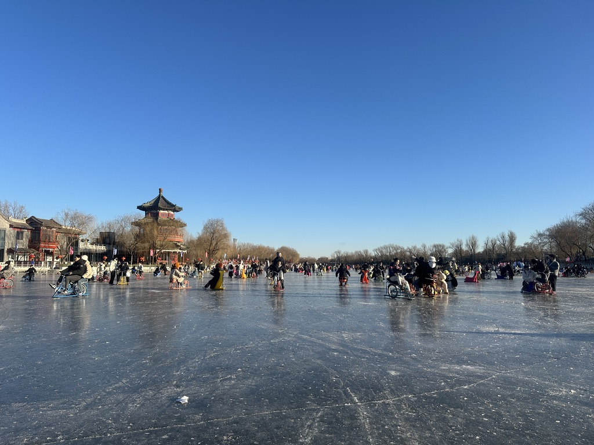
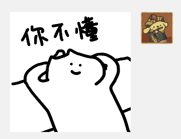
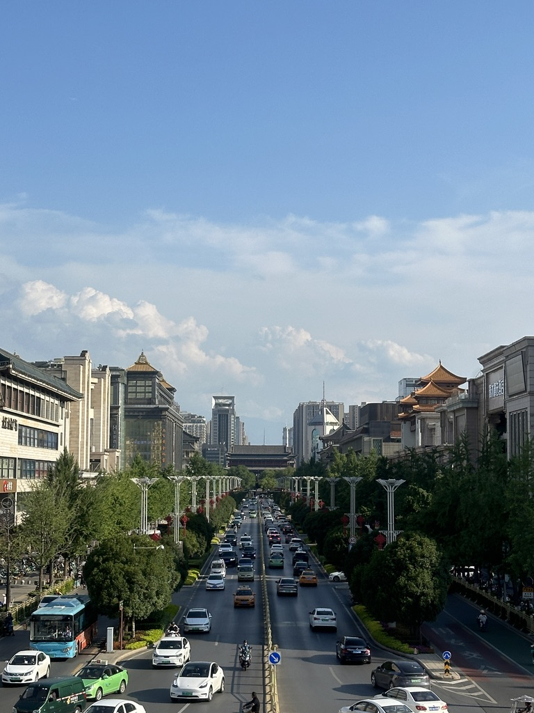
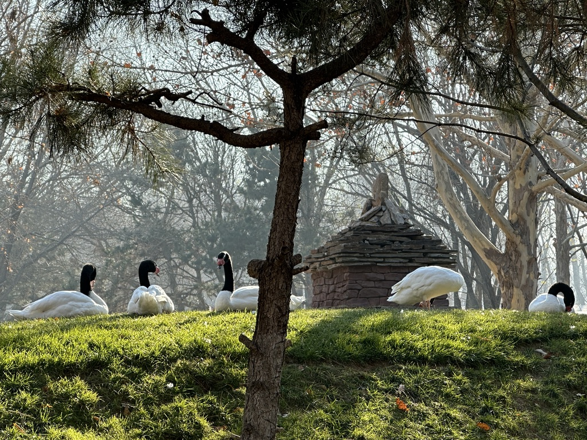

+++
date = '2024-12-02T18:26:04+08:00'
draft = false
title = '2024：写给青春的告别诗'
tags = ['江南旧话']
categories = ['personal']
showtoc = true
weight = 50
isCJKLanguage = true
searchHidden = true
license = "CC BY-NC-ND 4.0"
+++

> 如果2024有一个主题的话，我想，它应该是告别吧。

## 引子

空气中有雨的味道。

我已经很久没来这里了。

我好像在漫无目的地走，不知道要去哪里，但又好像知道要去哪里。

路上的青石并无言语，我似乎看到一些粼粼的回忆散落在水洼里，它们有些模糊而斑驳，在努力躲藏进粉墙黛瓦的最细密的缝隙。

我深吸了一口气。鼻子里有一种介于快乐和悲伤临界点的味道；它让人安心而沉迷。

我说不清这是什么，只是自顾自地向前走。我没有伞。我也不记得我带过伞。

这里怎么会没有伞呢，我来不及问。我感受到雨从四面八方涌来。

耳边像是传来悠远而绵长的吴楚旧谣。有的时候我觉得自己在一只船里，但这船裹着篷，于是连那些细密的回忆也不能飘散进来了。

我的眼前隔着一层纱，迷迷蒙蒙。面前有斑驳的烛火，分不清是否已经泪眼婆娑。这一瞬间我想到了很多，想到了毫无逻辑的词汇、一言不发的姑娘，和低着头自顾自走路的旅人。我像一只在三生石上爬行的渺小的蚂蚁，读不懂来时的路，也记不得此生缘劫。

我仿佛听到孩子的声音，他们饶有兴趣地在长廊下念着些古文或者是诗，像记忆中早已模糊了的幼时。有时候他们像是在呼唤我，但我的目光总是透不过这篷——最后连这些呼唤也要离我远去了。于是我只好继续前行，像过去日子里的无数次那样，带着迷茫和似懂非懂，被时间裹挟着长大。风声很大，脸上蒙着细细的雨，看不清，似乎也从未看清。

但我终于并不想就这样随波逐流地离开。蒙住的纱忽而坚硬无比，它正在轻而易举地扼住我的喉咙。我感受到挣扎、奔跑、疾驰，我似乎声嘶力竭、歇斯底里，想要用尽全力在没有尽头的岁月里留下不会有人注意到的痕迹；我浑身颤抖，似乎要从什么很深的地方落下去；我听到琴弦折裂，听到杜鹃啼血。我不想被埋葬，至少不能如此轻而易举。

这时我终于努力掀起了窗的一角。

外面有淡淡的香气，鼻子里有一种介于快乐和悲伤临界点的味道。

江南就在那里。它还是那般温婉，在天井里荡漾着一世又一世的泪滴。

**它让人安心而沉迷。**

## 跌落

> 冬天的太阳光线滑落在漂浮在空气中的灰尘里，慢慢地旋转着落下来。搬到六楼以后，暖气果然充足了些；有时候直到推门出去，我才意识到需要流水线似的裹上羽绒服和帽子口罩；这让这个冬天有了一种温暖的错觉。

如果2024有一个主题的话，我想它应该是告别吧。

我从未知道青春的定义；但在过去的这些日子里，我愈发明显地觉着它正在从我的生命里离去，似乎要带走我在人流的深海中踽踽独行的微光；而我曾经有的那些少年意气——如果我何其有幸的曾经真的拥有过它——似乎也要慢慢从我的日子里悄悄离开了。

燕子去了，有再来的时候；杨柳枯了，有再青的时候；桃花谢了，有再开的时候。

可我们的日子终究是要一去就不复返的罢。

关于2024，我真的想写很多很多。

我曾不止一次想要静下心来写点什么，就像几年前一次一次又一次的无数次那样；但是我愈发频繁地发现我似乎很难像当年那样下笔行云，思绪万千，稍加思索便有可以念上一年半载的心爱的句子；相反，我似乎更加深地困在日复一日的平淡和现实当中，好像在攀爬高耸岩壁的时候失去了一些着力点——我知道，更多人愿意把它叫做被生活磨平了棱角——**但我还没有失去完全的理智，试图在咬文嚼字的时候努力保留这份来自上一个时代的最后一点尊严**。

我的青春，要走了么。

它从兵荒马乱的告别开始，现在又要以一次又一次默默无闻的告别结束。我似乎在愈发清晰地感受到它的形状、它的声音；我不想就这样放任它跑掉，我从回忆里不断地搜索它的切片，一次又一次企图在脑海里重塑出当年的感觉；但我是无力的，就像徒劳地面对三维空间的投影妄图弄清楚四维物体本来的面貌那样。

这让我想起了《三体》里面外星飞船穿越四维空间翘曲带来的气泡——而我正在这些气泡的边界上，无比清楚地感受着这种魔幻却令人不得不相信的不真实。

此刻我像是四维世界最后的生还者，在北京起风的冬夜，跌落向那些在时间维度上被无限展开的鲜衣怒马的华年。

**“我看见时间凝固，跌落向你。”**

## 苏醒

> 书里无觉窗外事，一朝醒时非少年。

2024 是怎样开始的，我似乎有些记不清了；只记得本科的最后一年，日子的确是逍遥自在的——早就没了什么培养方案里面的课程，也不用顾虑多少科研的压力；闲多忙少，一来二去人便有些懒散——这些形容在现在看来已是奢侈至极。

同 h 小姐赶着年末去了一趟天津，在南开得到了热情的款待；踩着 2023 的尾巴，我们挤不上津湾广场满是看烟花表演的人的地铁，只好改签动车回到北京。2024，应该就是这么开始的。

在北大体验了第一次滑冰，h 小姐恰好修了门滑冰的体育课，于是便受到了一些指导；所幸我十年前曾自己学过旱冰，适应起来还算快速。后来我们去了后海，沿道旁的酒吧隔着玻璃窗传来蒙着哈气的乐手的民谣——它们还在那里，也可能它们早就不在那里了。它们总让我想起第一次来后海的日子。我们在结冰的湖面上踩着脚踏车，像滑雪一般用两根小棍拄着冰面向前快乐的滑行——除了一开始摔了一跤之外，这一切似乎都显得非常完美。“下次不许拽我！” h 小姐严肃地说。

然后是快活的寒假，体验了每天早上爬起来学驾照的生活。然而十分巧合的是，本来计划的科目二的考试因为暴雪取消，我也只得乘车返回北京——现在在 2025 我又将继续学车的生活。我们曾奉劝 d 先生不要提前回京，等等雪慢慢化掉一些，可是 d 先生既然刚刚成年，总是要有自己的想法；不出所料，在路上等了半日，在深夜才回到学校。而第二天我乘的车就没有遇到这样的问题。这成为了我们反复谈起的笑料。

然后是同 h 小姐过了生日，在三月的末尾去线下拜访了什么猫的工作室——可惜现在什么猫已经搬去了上海，但又庆幸我们恰好遇到过它。有时候走在路上，我们会无厘头地关于什么猫的表情互相提问——“你知道‘你不懂’这个表情里，什么猫的左手在上还是右手在上吗？”h 小姐沉思：“右手在上！”然而这并不是正确答案（至少嘴硬是这样的），因为这个表情里什么猫的两只手都在脑袋后面。“你应该回答‘左手或右手’！”我得意地说，“就像初中时候的平方根和算数平方根那样，4 的平方根是 -2 或 2。”显然 h 小姐并不买账，认为我实在是作弊。这个时候我就要贴出一张你不懂的图片来表达我的思乡之情了。

去 studio 的那天有些阴天，**但什么猫永远是微笑着的。这很好。**

然后到了清明。我们又去了一趟天津（天津真的很好！），参观了一些小景点，然后漫无目的地在街上走走，累了就干脆躺半天或者一天。4 月以上海之行开始，非常有幸去了一趟 BMW 中国的上海技术部门，同事们非常 nice，我们合作的项目也算是顺利完成，而且略加修改也就成了一次不错的毕设。回到北京之后很快我们就拉上 d 先生一同去了玉渊潭公园，它和香山公园一样成为了我们一年一次的固定行程。买到了好吃的文创冰淇淋，看到了很多人和花，北京的春天温暖而热闹。

五一假期去了沈阳，作为我们东三省省会的最后一站（虽然它到北京的距离是最近的）。本来设想一个错峰出游，最后还是遇上了熙熙攘攘的人群，在沈阳站外的德克士里，我和 h 小姐大快朵颐。盛京比北平更早入夜，在夕阳下的大悦城里偶遇 apple 线下体验店，也在小吃街里点上现在早就记不得叫什么的小零食。在故宫门口迎着大太阳排起了无穷无尽的长队，有几个小孩子和大人一起抱着雪糕盆，给慢慢蠕动的队伍塞进几分凉意。

值得一提的是体验了东北的洗浴文化，选了一家还比较新的洗浴店，浴池的墙上有大大的彩电，在放着不知道什么球队的比赛，搓背的师傅同我讨论北京到沈阳的高铁要开多久。楼上的休闲空间好像游乐场，吃喝玩乐一应俱全；走出洗浴店，正好天色渐晚，我们在街巷的烟火里吃着份量巨大的烤串。烧烤店的广告牌做了镜子来回反射的透视设计，影子重重叠叠的，让我想起在大帅府的窗外看到的树和落叶，它们交错缠绕，让我在某些瞬间有一种站在第三人称的视角看待历史轮回的错觉。后来我们去了西塔，在寺庙外看剪影，在龙城的夜里骑着共享单车穿过大街小巷。**生活似乎就是这样，平淡简单**。我对自己说。

夏天的开头我们去了西安，我上一次来这里已经是十年前了。鼓楼旁的购物中心还保留着我幼时在这里吃过哈根达斯的记忆，而城墙还是方方正正的，它们见过大唐。我们从雁塔一路向南，看芙蓉城、看曲江池、看民俗表演；后来体验了第一次古装和汉服，h 小姐格外美丽，我们在鼓楼旁遇到了一个同为大学生的摄影师，从他那里接过灯笼和小兔子，在来来往往的车流和人流中剪下一角夏天。“就是有点儿热。”但是夏天就是这样，炸酱面和卤鸭头都很辣，于是我也就心安理得了。

然后是毕业。恍惚间本科四年走到了尽头；花了几周时间赶出了毕业论文，一遍遍改PPT做了最后的报告；自己签字、找老师签字、去办公室签字，学生证撤销，领通知书和毕业证，四年来好多好多的日日夜夜，似乎就在这一瞬间突然有了结局。感谢 z 先生帮忙拍了非常满意的毕业照，当我在六教的阳光里拿起书本面对相机时，那些似懂非懂的公式和我好像见过，又好像不曾。**大多数知识早已抛之脑后还给了老师，而那些当时只道是寻常的日子，也说不定还到哪里去了罢**。

新学期开始慢慢适应成为研究生的身份，开始有了每周的计划进度，当然在汇报之前的效率才是最高的。我很喜欢 AIR 的氛围，我始终坚信来到这里是无比正确的决定。我们在做真的很有趣的事情，也在做我之前想象不到自己可以做到的事情。第一年的课业仍然繁重，此刻我对即将到来的数值分析考试还一无所知。有些稀里糊涂，抑或是抱着试一试的心态做了辅导员，让我这个 i 人在一开始有一种自己把自己狠狠踢出舒适圈的感受；但是这个岗位的确让我认识了很多人，了解了学校各个部门大家都在做哪些事情，真的站到了一个之前未曾设想过的平台看到了更多风景。h 小姐也给我提供了真的很多很多帮助，但我还是决定单独留出一个 section 给她，所以这里先按下不表也好。

学期中又启动了几次周末出逃计划，中秋节在天津的购物中心体验跳格子游戏，热情的老板送了我们一只可爱的大鹅（鹅门！）。我们在电视上看攀岩比赛到手心出汗，在店里吃撑了羊肉，还要点一杯桑葚冰沙来解馋。后来 h 小姐非常想去胖东来，于是我们定了去郑州和新乡的行程，参观了蜜雪冰城的大本营，在人民公园里玩健身器材、划了船，也花了五块钱在新乡动物园里看到了绝对值这个价的各种小动物。吃到了好吃的鸡蛋灌饼，在胖东来里买到了很多想买的东西。“东来顺，胖东来和胖哥俩，不知道为啥会起这么接近的名字。”这个问题困惑了我很久，不过现在我还是成功记住了。前些日子还去了北京野生动物园，同 d 先生一道，三个大学生在秋千、跷跷板和滑梯上玩得不亦乐乎。我们脱掉羽绒服外套，像孩子一样从山洞里钻进钻出，这真的是我许多年未曾有过的体会了。h 小姐有幸从一位善良的阿姨那里接过了投喂卡皮巴拉的玉米，这个毛茸茸的家伙在一番抚摸之后被冠名上“杂草一般”的体质；我们在餐厅外的桌子上排开三桶泡面，对着周遭的两只小猫大呼小叫。

“这两只猫咬人。”店员对我们说。

闲来无事，看到一位高中语文老师让学生们投票写下让自己最“意难平”的诗句，我看到他们写着含蓄动人的句子，这让我想到当年的自己，让我想到我第一次好奇地去问什么叫意难平。当时我得到的答案有些记不清了，但大抵和这个句子有些关系：所爱隔山海，山海皆可平。

我向来对它是有一些偏心的成见的：年岁渐长，我的文笔收束了很多，慢慢不爱华丽的辞藻，总觉得有几分俗气，不太自然。但这次它好像引着我重新看到了长安城外模糊的身影，让我在某些瞬间多了几分恍惚而失真的错觉。

然而冬天的暖阳终究转过身去，当无数的碎片从时光的沙漏里沉没进岁月的背面，我也早已不再是当年那个写下“毕业了，致青春”的孩子。

**醒时已是残局乱，竹也姗姗，烛也姗姗；归来雾正掩长川**。

我在 2020 年夏天写下这样的句子，背着行囊走向北京的秋天。

书里无觉窗外事，一朝醒时非少年。

可能直到现在我才真正醒来。也可能我永远没有醒来。

**欲买桂花同载酒，终不似，少年游**。

## 后记：笔者实录

> 现在是北京时间 2025 年 1 月 1 日的凌晨 2 点 30 分。

我没有睡，因为我希望把这篇文章发出来。晚上看了新年联欢晚会，h 小姐担任了舞监；她很辛苦，我坐在她后面区域的一个位子上，有时看看节目，有时看看她。晚会组织得非常成功，我真的很喜欢两个唱歌的节目和最后的舞台剧。等活动都结束，h 小姐从舞台上拍照回来，我们简单道了别，我就回宿舍来开始继续写这篇文字。之前写东西偶尔会拖很多次，但这次我的确是下了决心，一定要写完才好睡觉；而我的确也把主要的内容都写完了。之前一直没有单独给 h 小姐写点什么，既然有了这个机会，我也想简单写一写。

我真的非常感谢 h 小姐。h 小姐作为一个纯正的 e 人，在非常非常多事情上给了我很大的帮助。很多事情我一个人处理的时候，可能有些办法我能想得到，但是我不愿意做，或者不主动去做——倒不完全因为不好意思，可能有些 i 人属性背后的原因——但是 h 小姐在，这些事情就可以轻易的解决，哪怕还是由我来做，我也觉得自信且合理了起来。这个学期开始做辅导员，社工上的很多事情我的确缺乏经验，前期做了不少有问题的工作，h 小姐会和我一起解决这些问题，或者帮我做一些事情。h 小姐的确为我的生活带来了很多不同的可能，如果只是我，我可能不会去看新年音乐会，也不会去看话剧和舞蹈表演，甚至也可能不会接下辅导员的工作——我会在自己习惯的舒适圈里过得很好，但从今天的角度来看，这些改变，以及很多很多我无法逐一列举的改变，都让我受益匪浅。现在两个人相处的时间久了，慢慢真的成为了彼此最亲近的那个人，共同在生活的漫长日子里体会喜怒哀乐柴米油盐，很多时候真的非常感动。我并非处处完美，也绝无可能处处完美，但感谢我们一路走来双方的付出与包容，让我们成为了更好的自己。我们两个人其实很多地方都不相似，但恰好有很多可以填补对方的空白；我们都在用自己的方式爱对方，也在接收对方的爱。日子久了，很多情话反而说不出口，确乎是少了几分热恋期的甜蜜；但陪伴是最长情的告白，我想时间已经给出了答案。

我爱你，而且，谢谢你。

> 现在是北京时间 2025 年 1 月 1 日的凌晨 3 点 14 分。

## 后记：时间之外

“所以为什么要写这个引子呢？我不理解。”

**言之有物，而言之无物耳**。