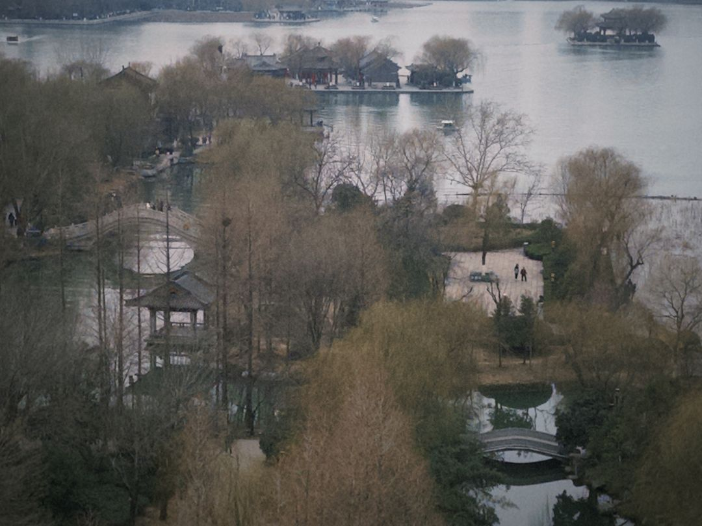
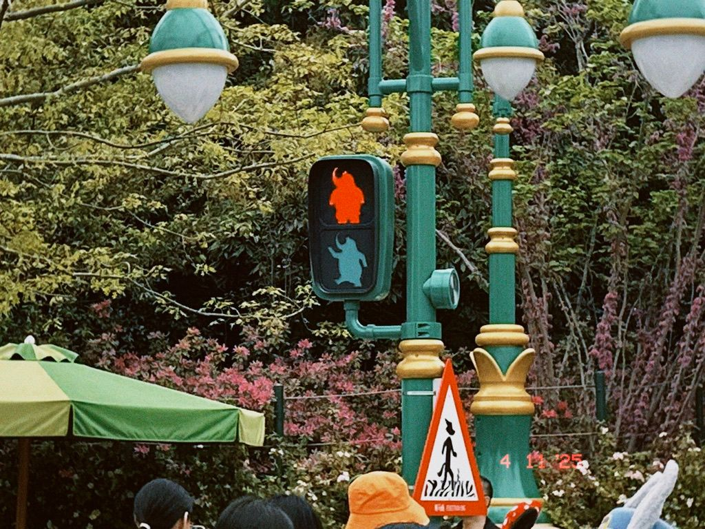
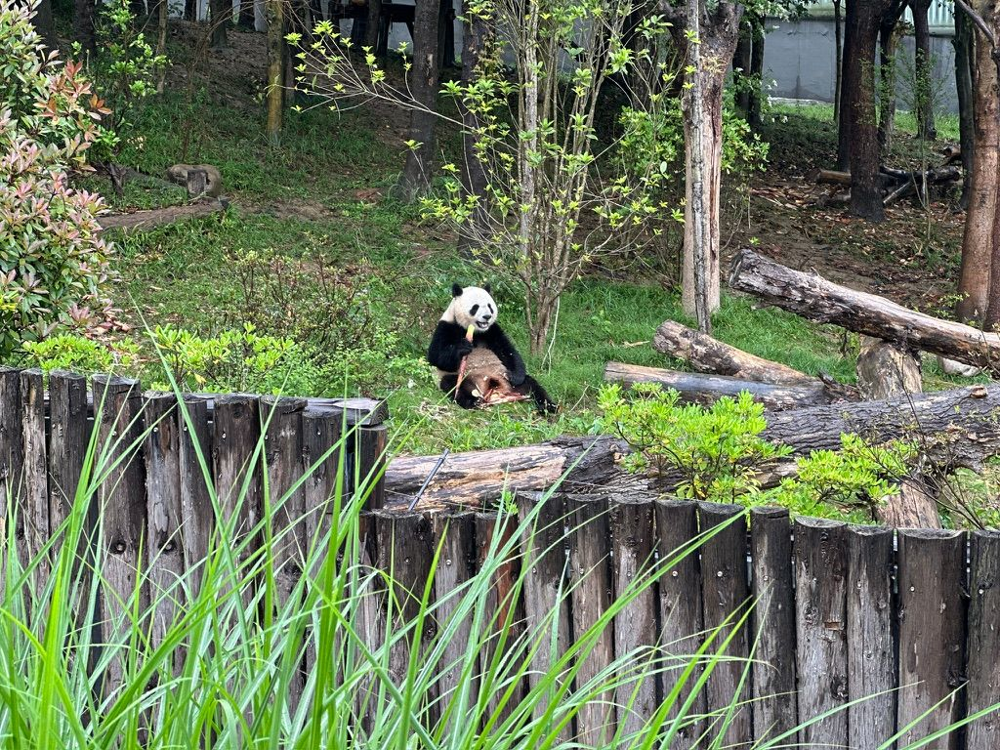
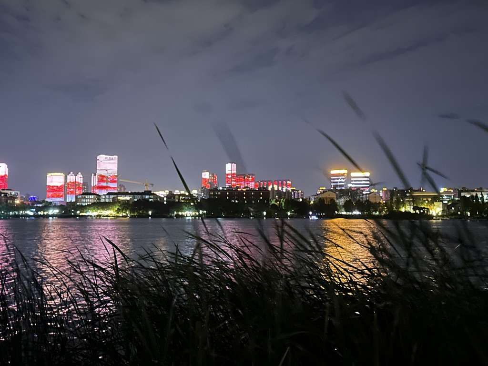
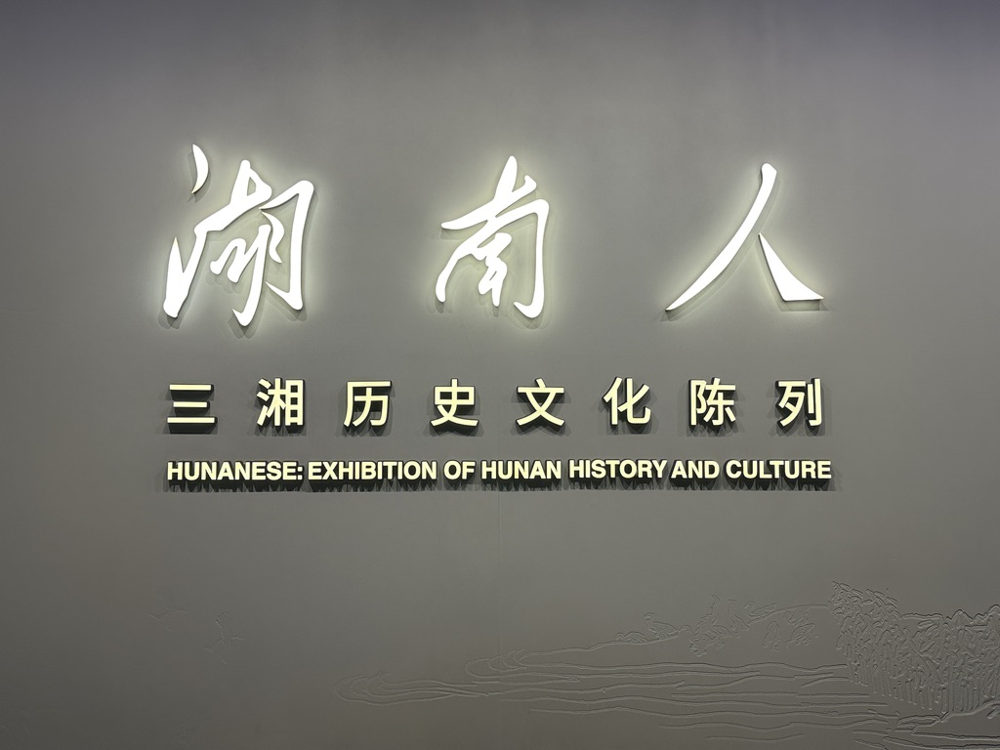

+++
date = '2025-08-07T00:00:00+08:00'
draft = false
title = '2025(1): 碎片与幻听'
tags = ['江南旧话']
categories = ['personal']
showtoc = true
weight = 45
isCJKLanguage = true
searchHidden = true
robotsNoIndex = true
hiddenInHomelist = true
license = "CC BY-NC-ND 4.0"
+++
## 一

我站在夜的顶端。

第一次遇见安的时候，她正在船尾收集碎片。彼时我恰巧打开舱门想要出来，险些撞上了她。

“船在时空海里航行，会落下很多碎片。” 

后来安对我说。

”收集这些东西有什么用呢？”

“你也觉得这些是时尚小垃圾？”她应该看了我一眼，但我假装正在整理咖啡杯壁上的糖屑。

为什么不是呢。我想。

毕竟这些碎片肉眼根本就不可见，我能看到的只是收集碎片的瓶子上贴满了五颜六色的贴纸，有的还有些标签。

但我没有反驳。

“好吧。看来您真得补一补天文学知识。” 安回过头来，煞有介事地从一排放着精致玻璃瓶的架子上选了一个瓶子，然后恰到好处地在我面前的桌子上叩响。

“这些碎片的形成机制非常复杂，我读大学那会儿曾经研究过这个。这和船的形状、空间状态都有非常微妙的关系。物体在时空中运动，一定会和时空产生相互作用，而这些碎片就是相互作用的证明。

”掌握收集碎片的能力，其实也就变相掌握了物体在时空中运动的一些特征。

“或者说得更高尚一点，我手里的这么一小瓶，可能就是某个东西在这个世界上存在过的证据。”

安晃了晃瓶子。我抬起头来。我们在那一瞬间隔着瓶子对视。

标签和贴纸之下好像确乎藏了些什么东西，它们交错在一起，从中心点散开，在瓶子的边缘散射出柔和的光晕；有些光从瓶子的边缘跳进了空间里去，很快消失不见；有些则重新回到了瓶子里，在围绕着某个几何中心做一些说不上来符合什么规则的运动。也有一些光穿过了瓶子，围绕在安的眼睛周围。

那里仿佛汇聚了黄道十二宫的星光。

“算了，跟你说你也不懂。” 于是那些光又被关进了瓶子，放到了架子上，从我的视野中消失了。

“不过，不是所有的碎片都能收集得到，很多碎片很快就会湮灭，我也不知道为什么。

“实话说，现在这方面的研究还非常初步。我们甚至没有办法从这些碎片当中解读出任何有用的信息，目前能做的只是检测和收集它们。

”关于它们能否被解读出什么有价值的信息或者意义，现在谁也不知道。

“起初大家都很关注这些东西，政治家和军火贩子对它们有一股成瘾性的狂热，后来哲学家也加入了进来，然后是公众，大家吵来吵去，最后吵不出什么结果，研究慢慢遇到了瓶颈，也就没有什么人还继续关心了。”

安坐了下来。她眼中的星光也消失了。

“后来呢？”

“后来只有非常非常少的实验室还在继续坚持对这些碎片的观测和研究。我们就是其中之一。但再后来遇到了战争。战争打乱了一切。什么都没有了。

“我也没拿到学位，上了船，不知道要去什么地方。我只有这些瓶子，还有里头的这些东西。”

我想说些什么，但恰巧船舱里大声播报了即将到达的站点信息，于是我最终也没有说出来。

我快要到站了。

## 二

又到了每天都不愿意在室外呆上一秒钟的季节，只想躺在冷气充足的房间里裹着被子一动不动。顺利通过了科目三，拿到驾照的日子已经写上日程；爸妈决定开车回一趟老家，于是在靠着安全带瞌睡的颠簸中穿过大别山和洞庭湖。记得小学的时候每年过年都会开车一路回来，我们走一路玩一路，武汉、长沙、南昌，还有周边的池州、赤壁、黄石，都慢慢构成了童年里面“年味”的一部分。后来上了中学，时间愈发紧张，便几乎没有怎么回来过了。

最终车开进了这个湘中的小城，隔着老远就认出了收费站和旁边的楼房。这么多年过去，这里好像仍然按着暂停键，街头巷尾还保留着来自二十一世纪前两个年代的那种既熟悉又陌生的感觉。有时候不自觉会找回当年的心境，似曾相识的场景像彩蛋一般在青春的末尾被反复播放。这些事情好像就在昨天发生，但确实已经过去了很久很久。

我好像行走在碎片里。这场景像是在秋后的树林里，听脚踩厚厚的树叶的声音。

## 三

“八月份啦。” 我咬咬嘴唇，在聊天框里对 2025 年的 7 月告别。

也许是时候写一写上半年的故事了？我想。

那就写一写吧。

2025 的开端是赶论文投稿的 deadline。疯狂写代码、做实验、写论文，好像从百草园赶到三味书屋。低头开始做的时候还是大年初七，点击 submit 再抬头的时候，学堂路的花已经盛开了半个春天了。

这段日子属实是令人印象深刻的——人仿佛有一种进入了无穷无尽的本科期末周的状态，计划表被安排得满满当当，掐着日子数一数还要加多少组数据放到 paper 里面。最后一个星期五改图到凌晨三点，周六 h 小姐来工位陪我加班，我们两人点了披萨和奶茶的外卖送到楼下，在 11 楼的吧台上看着远处闪烁着霓红灯的中关村。这个时间还在工位的人很少，我们吃完东西、玩了会游戏，然后又重新堕入到 LaTeX 代码的注释删了又改的轮回。拉着一个超级巨大的 excel 表格做简单的数据趋势观察，然后把有用的信息拿到 python 代码里画图贴进文章，就连 adobe illustrator 都被舞得虎虎生风了。

**简直是个超人。**

现在回想起来，还是感觉非常 impressive。

虽然因为诸多原因没有顺利地一次性投中，但这个工作在公开之后也的确得到了一些关注和认可，至少说明我们做的事情是有价值的。我们还可以继续做得更好。

2 月的末尾，我们去了济南。济南是我非常喜欢的城市之一，之前有幸造访过几次，不过要么是年代久远（2009 年），要么是没有怎么仔细游览。我们在泉城广场的台阶上伴着夜色和音乐看喷泉和来往的人们，顺着护城河从东走到西。

**“我要一个里脊夹烧饼。” h 小姐说。**

去大明湖的那天温度刚刚好，因为住的地方距离整个景区不太远，到各个地方都差不多是两公里的路程，索性我们全程步行前往了。在湖畔看到了颇负盛名的夏雨荷，在曲水亭街里我们一人拿着一杯茶百道。h 小姐化了很美的妆，于是我们在桥与亭里拍下了很多同样很美的照。超然楼外等满了一大群长枪短炮，和西安颇有几分相似。我们沿着楼梯拾级而上，念着写在台阶上的诗词。济南这天阴阴的，从楼上向下看，有几分水墨画之姿，实属心旷神怡。

“鹊桥风月千帆渡，不知江南何处。” h 小姐念了念我的朋友圈文案。“这啥意思？”

**“仔细想想。” 我笑了笑。迂腐的文人又要开始写诗。**

然后是 deadline 赶完的 4 月。h 小姐想去迪士尼玩，于是我们便又拼凑出一个周末来。落地上海的广播在机舱里响起的时候，我们爆发了一阵小小的欢呼——原定在中午起飞的飞机没能赶上，改签到晚上又怕北京的大风会影响起降——但最终确实是逃过了一劫，一切又都重新继续满心欢喜了起来。

赶着清早的第一批入园，我们在各式各样的项目里穿插来去，在排队的间隙里玩成语接龙；由于我每次质疑都能成功，h 小姐总是不服。在疯狂动物城里和各种动物拍了合影，坐上了十分有趣的小火车；天色渐晚，我们在湖边吃着牛肉卷，湖面很宁静，里面有虫鸣——虽然可能是音效，但这种场景给人的感觉真的很好。体验到了和长影世纪城类似的飞天观影设备，在暗流里看杰克船长寻找失落的宝藏；我们赶到城堡脚下，看着光影和烟花一遍一遍地播放电影中的画面，那个瞬间仿佛世界都是安静的，只有童年和回忆流淌的声音。

出来的时候在湖里又遇到了我们入场时候碰到的几只鸭子，它们不会说话，只是歪着头看我们。

”今天没签到，问题不大。”

于是我便心安理得地在返程的出租上睡着了。

感谢 y 先生在南京路的热情款待，带我们吃了非常好吃的自助餐；也是终于难得在上海见了一面。我们逛了逛二次元的小商品市场，又和 Apple 线下店偶遇；在人来人往的地铁站里，我们拥抱后告别。武康路的夜里，我们和弄堂与藤蔓相遇；抬头看是高楼大厦，闭上眼是若隐若现的虫鸣。

**“上海总归是要比北京多一些生活气息的。” 我呢喃。**

五一假期我们错峰来了成都，顺着黄土高原和秦岭一路南下，在熙熙攘攘的客流之前抵达蜀中。

**“You know what, ” h 小姐说，“成都机场的字体很可爱！”**

这里的天气阴阴的，会议没结束的我举着笔记本拎着行李箱走在大街上。民宿的门口有一只小猫，它安静地趴在楼梯间里不说话。我们在楼下的超市里面买了矿泉水和零食，投影里面播放着2020年的好声音。我们从春熙路的熊猫身下走过，在街巷的尽头对着不放辣的冒菜重拳出击。h 小姐买了麻辣兔头，我们一遍又一遍地念叨着一元一串的钵钵鸡。

起了大早去看都江堰和青城山（这起早的程度和西安兵马俑的那天有的一拼），**我们站在数千年如一日的宝瓶口，从崇山峻岭中走过茶马古道的一个个关口，总有一种正在注视历史书的错觉。**青城山后山彼时并没有多少游客，山上有很多很多垒得高高的鹅卵石块，像某些名山顶上会挂着的那些红飘带和同心锁。

“来都来了，总得留下点什么。” 于是我弯下腰，在小小的河道里搬走了鹅卵石组成的堤坝；山泉水便不再打转，直直地从那个缺口中溜走了。下山的时候正好赶上了索道的末班车，我们在春熙路重新坐下来吃烤匠，豆腐和鱼的味道都很好。

这个时候，外面的大街小巷终于迎来了 4 月末的第一批游客，拉着行李箱的年轻人和呼喊蹦跳的小孩，慢慢构建成黄金周的成都该有的模样。

转眼又到了一年的毕业季，d 先生很快也要去南方继续读书，从此在北京便又少了一个能毫无顾忌地放声大笑的挚友（但在南方多了一个！）。早先和 w 女士约定好了在毕业之前去趟长沙，于是 d 先生便也和我们一同前往了。

长沙的夏天真的比较热，每次出门都恨不得马上结束一天的行程 doge。我们在大街小巷见到了无数茶颜悦色，在黄兴路的一角吃着费大厨。

**“你好，你好！这是我们店的招牌菜！” h 小姐对着先端上来的一盘鱼开始练习。**

我们在湖南博物院看到了金缕玉衣和很多文物，顶楼有一个艺术家的画展，在里面逛有一种在艺博的错觉。

w 女士带我们吃了有名的笨萝卜，晚上一同在中南大学和后湖骑车。中南大学的校园真的很大，得到了我们三人的共同首肯。芦苇丛外，湖的对岸有悠扬的手风琴。

彼时的我并没想到，一个多月后，从老家返程的路上又经过了长沙，和爸妈一起重新在五一广场外溜达，然后在湘江边上驻足。家里的亲人们围着大圆桌坐得满满当当，当年一起玩耍的弟弟妹妹们有不少都上了大学，这时才反应过来上上次见面已经十年有余——此时便真切地感受到何谓恍如隔世。今年回老家吃了很多据说比较辣的菜，但我非常意外地都没有感觉到特别辣。不知道是他们在开玩笑，还是我真的吃辣水平有所提升——却也难怪，起码我也算半个湖南人吧。

## 尾声

“送给你一些瓶子吧，至少挺好看的。”

“我手里的这么一小瓶，可能就是某个东西在这个世界上存在过的证据。”

“掌握收集碎片的能力，其实也就变相掌握了物体在时空中运动的一些特征。”

安回过头来，煞有介事地从一排放着精致玻璃瓶的架子上选了一个瓶子，然后恰到好处地在我面前的桌子上叩响。

毕竟这些碎片肉眼根本就不可见，我能看到的只是收集碎片的瓶子上贴满了五颜六色的贴纸，有的还有些标签。

“你也觉得这些是时尚小垃圾？”

”收集这些东西有什么用呢？”

“船在时空海里航行，会落下很多碎片。”

我猛然惊醒。窗外的时空海里，星云正在规律地旋转。

手边的桌上，其中一个瓶子倒下了，它的瓶口开着，边缘散射出柔和的光晕。

这是一个来自旧历 2025 年的第 0035589 号故事。

第一次遇见安的时候，她正在船尾收集碎片。彼时我恰巧打开舱门想要出来，险些撞上了她。

**我站在夜的顶端。**
