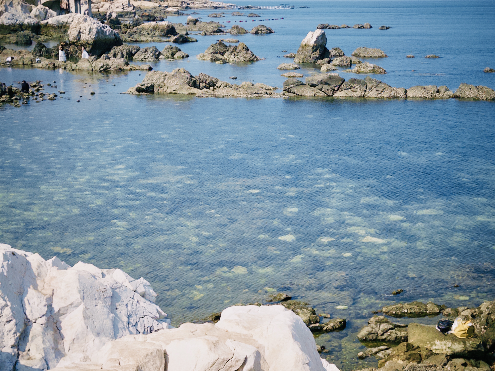
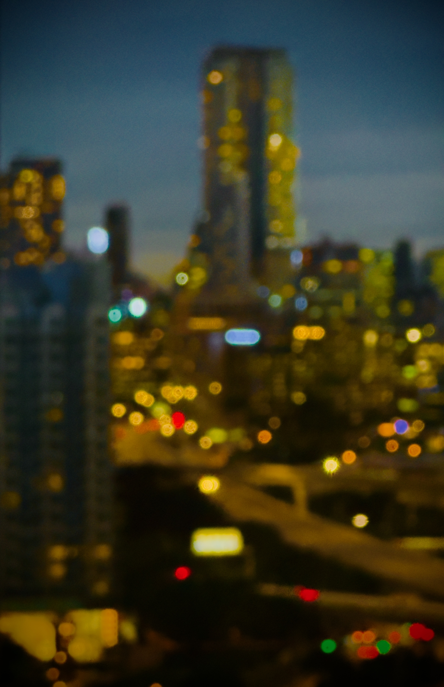
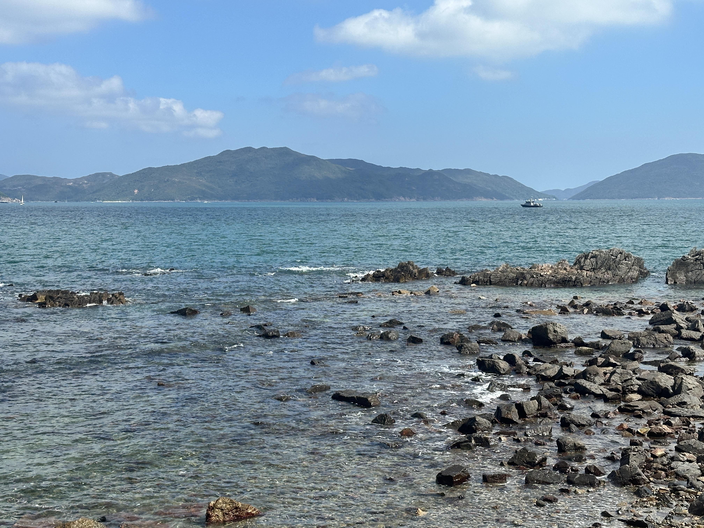
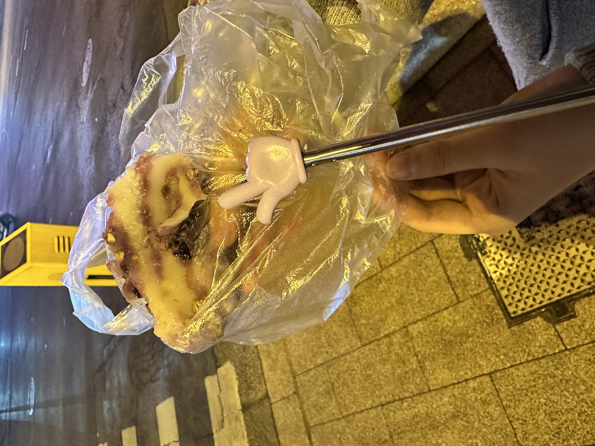
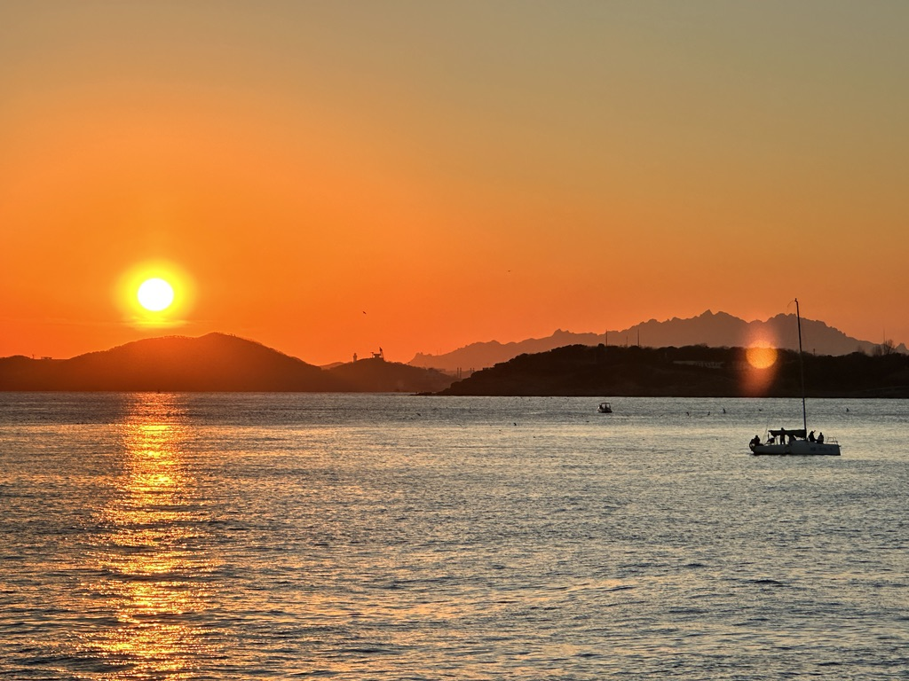

+++
date = '2025-12-31T21:20:04+08:00'
draft = false
title = '2025(2): 黄昏与兔子洞'
tags = ['whisper_from_dreamland']
showtoc = true
isCJKLanguage = true
contentLang = "zh-CN"
robotsNoIndex = true
license = "CC BY-NC-ND 4.0"
+++

## 引言

忽而又一年。前些日子还觉得一月还要再等上一个世纪那么远才会到，但现在好像很快就要来了。

于是我坐下来，看着窗外发呆。远处是一排排树冠，密密麻麻好像画笔把下方夕阳留下的一点鹅黄色晕染上清冷的天空。

半年的时间稍纵即逝，好像有些感触，又好像没有什么话可讲。其实我很早就开始构思2025年第二部分的标题应该取什么才好，我在备忘录里密密麻麻记录了四五百字的灵感，然后定下了“兔子洞”这样一个颇有几份引人注目和神秘色彩的关键词——它让我想到爱丽丝，想到雏菊花、三月兔和永远喝不完的下午茶——不过大概还有一些更深层次的另外的考量，出于我的写作风格，我自然不愿意把所有事实和盘托出。有的时候我像一只拙劣的仓鼠，想在平淡的现实之外藏匿些昙花一现般的思绪，然后不厌其烦地在日后再取出来反复品味把玩。这样的载体还有很多；我是一个可以在听到某一首歌的时候瞬间重温第一次听到这首歌的感觉和感受的人，所以音乐和故地重游一样，能够迅速解冻一些藏在厚厚的琐事背面的东西。我觉得音乐对我的影响很大，我很喜欢音乐，少年甚至童年时期的音乐喜好在很大程度上参与了我的性格和写作风格的本初构建。我喜爱读书，尤其喜爱诗歌，讶异于这些古老的东方艺术所蕴含的极具表现和深度的张力——草蛇灰线、伏脉千里；山水画的墨色和留白，文学作品的伏笔与呼应，强调的都是“意在言外”，看不见的、不存在的那个部分，才是能带来最有深度的感官上的冲击和洗礼的那一部分；**大隐隐于市、于无声处听惊雷**。故而我爱江南烟雨、爱星辰黄昏；辗转最是朦胧侧，多情自在不言中。回头审视自己这些年来有幸留下的几篇拙文（真的是有幸，因为我愈发觉得生活总会在某刻把表达和记录的能力从我身上带走），每每重读，总还有孩童时代剥开糖纸的快乐，总还觉得凤箫声动玉壶光转，杯中酒尚温。

前些日子在楼下停了车走回房间的时候还在想，直来直去的记叙和精心构思的三五文字究竟有何不同，而我看似也得到了一个颇为有趣的结论：假设平铺直叙是一种平凡的线性映射，只包含这些文字本身所拥有的意义；那这些小片段则很有可能在更高的特征维度上编码了写作时的记忆和思绪的一个隐式的复杂的函数，每次阅读像是输入一个当前状态的向量，然后获得一个同样在特征空间上的复杂的输出，我们称为感受。一千个读者有一千个哈姆雷特，重读一千次的我似乎得以同时和不同时空中的一千个我站在同一个空间交流——也许这就是创作的意义，它能让我以更真实和更丰富的方式记录生活。

“**太抽象了，怎么会有这么学术的想法。**”我摇摇头。但是毕竟这说明一年学没有白上，于是我只好又点了点头。

## 日子

九月份从旧宿舍如愿搬到新宿舍，终于有机会提高了在学校的生活水平。但搬家一如既往地令人疲惫不堪，收拾东西的时候想的最多的一句话是“为啥我还有这个东西”，而搬的时候则感觉自己像个蜗牛要把生活的整个壳都搬走一样。彼时h小姐作为新生辅导员正在带军训，结束后就过来帮了帮忙。

“**辅导员检查内务！**”h小姐一身军装，并指导我把床帘以正确的方式挂好。

整个九月都是平淡的；我们周末偶尔出去找点吃的，偶尔四处瞎逛，在附近兜兜风。“国庆节去哪好呢？”我们在鸟巢门口反复分析，最终还是决定避开热门的大同和青岛，转而计划去烟台。我们住在大学附近，有很多小吃；和秦皇小巷有一些相似，但经过一番评价后还是认为不及。去养马岛的那天人并不多，我们租了一辆电瓶车在岛上兜风，看着滩涂上的淤泥和沙，和城市渐行渐远。这里的沙滩上住满了不及指腹大小的小螃蟹，我们走在沙滩上，看着它们像潮水一样跑来跑去，在洞口堆起一个精巧的圆形小球。“不知道它们出来之后还能不能找到自己家啊。”我想。果冻海很美，波纹在水面上反复干涉，散发着独特的光。海肠捞饭很好吃，我们站在黄海明珠的长廊尽头，仔细眺望着面前广阔的海。这里的海是黑色的，只有遥远的地方有几点灯光，不知道是灯塔还是渔船。去了h小姐心心念念的水族馆，我们隔着厚厚的玻璃对着海牛发出高高低低的“哞”。

但是海牛不说话，只顾着吃水草。**不知道为什么，可能是没听到吧。**

十一月份有幸来香港开会，我还是有些激动的；毕竟是头一次来，又有一个星期的会议周期，还有学术蝗虫最爱的茶歇，除了下飞机之后太热之外一切都很好。落地的那天是阴天，广播里的粤语和英语轮番播放，远处有山和大海。提着行李的我准备从副驾上去，“**你坐那边要开车的喔。**”于是我只好挠挠头回到左边。

走在街头，行人匆匆，车水马龙，路口有竞选的标语，大楼上有上世纪八九十年代的那种招牌，这让我有些迷失在早年电影中的错觉。我们住在红磡，对面就是维多利亚港；海岸边种了很多棕榈树，小道上有很多人在慢跑和交谈。参会的华人真的很多（甚至比在大街上见到的华人都多），听了一些报告，吃了很好吃的茶歇。我们坐着叮叮车走过一条一条街道，参观了跑马场，很多老年人像国内彩票站里一样拿着笔和本子在仔细做投资的分析。场边有啤酒和香槟的狂欢，这些景象偶尔会让我觉得不太真实，但又的确是实实在在见到了的。

独自待了几天之后，h小姐趁着周末和生日从北京赶过来。我坐上巴士去机场接h小姐，在某些时刻竟然也会有一种异地恋见面的恍惚。我们在旺角的菜市场闲逛，在中环的apple store驻足；爬上大馆的时候天空下起了蒙蒙雨，但我们还是决定继续向山上走了。坐上了无数多级的登山电梯，路上总能遇到一些天主教的教会小学。愈往上走，似乎愈发要走进香港的更深处；这里有普通人的everyday life，没有山脚下那样繁华和匆忙，反而多了一些宁静和安谧。我们坐着小巴下山，又在码头搭上落日飞车；虽然因为那天的天气原因没看到落日，但也的确是次难得的体验。回程的路上还遇到点插曲；立交桥错综复杂，导航有些不太聪明，我们花了不少功夫才找到回去的路。在美心蛋糕店取回早上订好的蛋糕，D先生也从深圳坐车赶来，甚至酒店的客房服务也准备了一个精致的小蛋糕。23岁生日就这样非常nice地开始了——“**为啥明天有pre啊。**”我在朋友圈里愤愤不平。结果就是那天晚上在酒店赶完PPT又全英文练习到两三点钟，然后沉沉睡去，并在次日早上五点多起来去赶会议方提供的六点多的前往workshop地点的班车。

港科的校园建在山上，风景很不错，大平台的远处有晨雾，恍若是“忽闻海上有仙山”了。pre结束之后在门口见到了久别的K先生，h小姐和D先生也打车过来。我们乘坐一趟又一趟电梯，在山脚下看到了非常漂亮的风景，不愧为亚洲最美校园。晚上我们去尖沙咀吃了冰室，在大街上围着一台手机看着B站的KPL总决赛。而后香港的一切就愉快的结束了，临走的时候我已经无意中学会了在借过的时候改口称“Excuse me”了。在飞机上睡了一觉，而后我们又回到了北京的冬天。

十一月的中旬我们去了沧州（**周末到河北！**），在火锅鸡店家的门口排队，穿过南川老街熙熙攘攘的街道，两旁摆满了贩卖各种商品的小摊，多是手工艺品和小吃之类，也有套圈，甚至还有不少人带着很多小猫小狗来售卖，颇有些赶集的说法。朗吟楼外有围了里三层外三层的歌手，我们喝了怂柠，逛着如果有家面包店。沧州博物馆可看的东西倒是比较有限，我只对京杭大运河比较感兴趣，毕竟我家也有运河博物馆。

前些日子忙里偷闲去了青岛，趁着h小姐难得有空闲的周末错峰拜访了这个我们没在国庆玩到的城市。“如果这次不来，下次节假日可能大概也不会再来！”h小姐义正辞严。于是我们说走就走，坐了三个多小时的高铁抵达山东半岛的南端。吃火锅打卡意外收获了一个小手指，和曾经风靡小红书的款式如出一辙，于是我们本次出行的所有照片几乎都用上了它——我只要一拿手指指着h小姐刚买回来的临沂年糕，h小姐就止不住地咯咯笑。参观了青岛啤酒博物馆，附赠了四杯啤酒我一个人可能喝掉了其中的三杯半；原浆的口感非常绵密细腻，成品的啤酒尝起来自然就和平日里能接触到的品牌差距不大了。但原浆的后劲还是足够，参观啤酒生产线的时候我们已经有些脚下生风；啤酒在机器里罐装，然后沿着轨道快速送进一排排机器里面打包装箱，还有自动化的机器人负责货物的搬运，一切看起来都井井有条——这让我想起来多年前参观家乡白酒厂的时候，不过那次参观没有给大家赠送免费的酒来品尝，的确是明智的选择。

离开博物馆之后的相当长一段时间里酒精的作用还未散去，直到我们坐下来吃了一大碗海鲜饺子之后才算清醒了一些。午后我们在海边不远的地方转悠，从信号山爬到小鱼山，从八大关到海水浴场。宫崎骏一条街的墙壁上画满了漫画人物和打卡点，h小姐举着快没电的action相机对青岛的夕阳告别。山顶有画画的艺术家，有拍照的闺蜜和情侣；路标上写着到北京和上海的距离都是549km，而我则对珠颈斑鸠更感兴趣一些。

“快看咕咕！”我兴奋地计算着斑鸠的数量。

“北京有很多！”h小姐说。

**那我不管。咕咕咕是很好的。不同地方的咕咕咕不一样。**

值得一提的是临走之前我们在燕儿岛看到了非常非常美丽的日落，而h小姐看到了综艺里面曾经取过景的白塔。这里的视野非常开阔，好像和之前在秦皇岛和烟台看到的海都很不一样；我很难再将那种宽阔和宁静表达得透彻，但在一个刮着海风、略有些干燥的冬天，这里的黄昏似乎格外的静谧安详。我们在围栏边戴着厚厚的帽子口罩和手套，看着远方的夕阳慢慢沉入山野之外；厚厚的拦水坝的外侧有老人在静坐，也有人在钓鱼或航拍。这时候的海面似乎已经不再是海面，而更像是缀满了岁月的树干，埋藏着厚厚的年轮。过了一会，天色渐暗，我们便启程返回；进站口挺远，害得我们跑了一小会儿，坐上车已经是气喘吁吁。

“山东挺好，”我说，“不过明年可以换一个地方玩玩啦。”

## 黄昏与兔子洞

2025.11.9

走出地铁站，迎面而来的是北京干燥而清冷的空气；彼时，这里的冬天正要开始。

h小姐在电瓶车的后座上感叹，**“我们又回到了——”**

**“现实。”**

我把外套的拉链拉到顶。

**爱丽丝不会再掉进兔子洞了。但三月兔还有喝不完的下午茶。**

**新年快乐。**